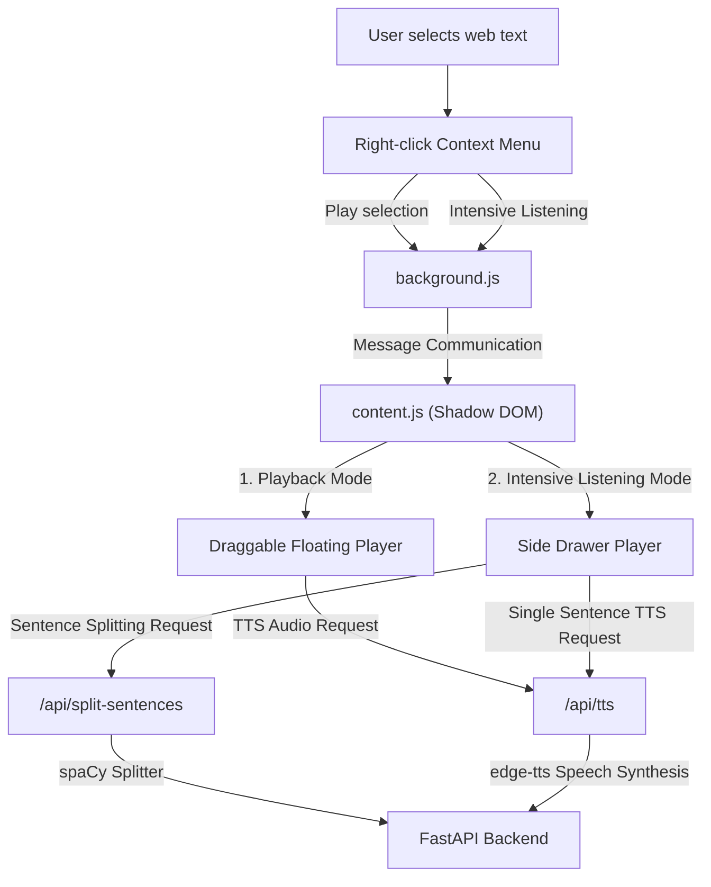

# Select-to-Speak: English Reading & Intensive Listening Assistant

[](#-chrome-extension-installation-appsweb-extension)
[](#-backend-api-deployment-appsapi)
[](#-backend-api-deployment-appsapi)
[](https://opensource.org/licenses/MIT)

A custom-tailored Google Chrome / Edge browser extension designed specifically for English language learners. This tool allows users to select any English text on any webpage and listen to high-quality speech rendering, as well as engage in systematic, sentence-by-sentence intensive listening exercises.

---

## 🏗️ System Architecture



### Component Overview
- **Backend API (`apps/api`)**: Powered by the Python FastAPI framework. It leverages `edge-tts` to hook into Microsoft Edge's highly natural, neural Text-to-Speech voices, and uses `spaCy` (configured with a lightweight English sentencizer pipeline) to split long passages into accurate, punctuation-aware individual sentences.
- **Web Extension (`apps/web-extension`)**: Built on the modern Manifest V3 standard. To prevent styling conflicts, all user interface components are encapsulated in an **isolated Shadow DOM**. This ensures that the extension's Tailwind CSS styles remain fully independent, preventing host page CSS from overriding or polluting the extension UI.

---

## 📂 Project Structure

```
select-to-speak/
├── apps/
│   ├── api/                 # Python FastAPI backend service
│   │   ├── main.py          # Backend entry point
│   │   ├── requirements.txt # Python dependency definitions
│   │   └── Dockerfile       # Containerization setup
│   └── web-extension/       # Manifest V3 Chrome Extension
│       ├── manifest.json    # Extension configuration
│       ├── content.js       # Content script (handles Shadow DOM player and drawer)
│       ├── background.js    # Service worker (manages context menus)
│       └── options.html/js  # Premium options and configuration page
├── docker-compose.yml       # Docker orchestration config
└── README.md                # Project documentation
```

---

## ✨ Key Features

### 1. Play Selection (Webpage Speech Playback)
Highlight any English text on any website, right-click, and choose **"Play Selection"**:
- **Elegant Floating Player**: An on-screen widget that can be dragged freely.
- **Full Playback Controls**: Includes loading animations, play/pause toggles, and 5-second fast-forward/rewind skips.
- **Boundary Detection**: Prevents the widget from being dragged off the visible screen area, ensuring it's always accessible.

### 2. Intensive Listening Drawer
For larger articles or multi-paragraph segments, highlight the text and select **"Intensive Listening Selection"**:
- **Glassmorphism Side Drawer**: A highly modern, semi-transparent frosted glass drawer slides smoothly in from the right.
- **Smart Sentence Breakdown**: Automatically splits the text into clean, individual sentences using the backend `spaCy` NLP pipeline.
- **Dynamic Interaction**: Hovering over cards highlights them, and the currently active playing sentence is highlighted in a vibrant, elegant purple.
- **Smart Viewport Alignment**: As the audio transitions to the next sentence, the scroll container automatically and smoothly scrolls to position the active sentence perfectly in the vertical center of the screen.
- **Sticky Footer Player**: Audio controls are locked to the bottom of the drawer. Features advanced learning options such as **"Single Sentence Loop (Loop)"**, "Replay Current", "Previous/Next Sentence", and a custom progress seeker.

### 3. Premium Options Page
Access the clean settings hub to fully customize your learning experience:
- **Zero-Config Backend Pathing**: Auto-detects the active environment (localhost:8000 in dev mode, containerized or production endpoints in release mode). Includes a one-click connection benchmark showing round-trip latency in milliseconds.
- **Microsoft Edge Neural Voice Picker**: Directly pulls a list of available premium voices (e.g., highly realistic and human-like voices such as `Ava` or `Andrew`).
- **Granular Speech Rate Control**: Provides an intuitive speed adjustment system along with helpful tips (e.g., `+10%` to challenge comprehension, `-15%` to practice fine-grained pronunciation).

---

## 🛠️ Backend API Deployment (`apps/api`)

The backend can be spun up using **Docker Compose** (recommended) or via a **local Python environment**.

### Option A: Using Docker Compose (Recommended ⚡)
Ensure Docker is installed. The repository includes a preconfigured `docker-compose.yml` that maps the host port to **`18002`**:
```bash
# Start the backend services in the background
docker compose up -d --build
```
The API service will now be active at `http://localhost:18002`.

### Option B: Local Python Installation
Requires Python 3.9+:
1. **Install dependencies**:
   ```bash
   cd apps/api
   python -m pip install -r requirements.txt
   ```
2. **Start the API service**:
   ```bash
   python main.py
   ```
   The local service runs on `http://localhost:8000`. 
   > [!NOTE]
   > If you deploy manually on port 8000, verify the endpoints in `options.js` and `content.js` match your port configuration.

### 3. API Specification

* **Split Sentences**  
  `POST /api/split-sentences`  
  - **Body**: `{"text": "Hello world. Let's study English!"}`  
  - **Response**: `{"sentences": ["Hello world.", "Let's study English!"]}`

* **TTS Audio Stream**  
  `GET /api/tts?text=Hello&rate=+0%&voice=en-US-AvaNeural`  
  - **Response**: Binary audio stream (`audio/mpeg`)

* **Retrieve High-Quality Voices**  
  `GET /api/voices`  
  - **Response**: List of available neural voice configurations

---

## 🧩 Chrome Extension Installation (`apps/web-extension`)

### 1. Compile Tailwind CSS
The extension uses pre-compiled Tailwind CSS to fully comply with Chrome Web Store Content Security Policies (CSP) which forbid inline styles and external CDNs:
```bash
cd apps/web-extension
npm install
npm run build:css
```
This output is written to `dist/tailwind.css` as a highly optimized, unified style sheet.

### 2. Load the Unpacked Extension in Chrome
1. Open Google Chrome or Microsoft Edge and navigate to the Extensions management page (type `chrome://extensions/` in the address bar).
2. Toggle the **"Developer mode"** switch on in the upper-right corner.
3. Click the **"Load unpacked"** button in the top-left corner.
4. Select the `apps/web-extension` directory from this repository.

---

## 💡 Practical Learning Tips

- **Troubleshooting Audio**: If speech is not playing, open the extension **Options**, click the **⚡ Test Connection** button, and verify that the backend API is up and running.
- **Optimal Speed Settings**:
  - **Natural Reading**: `+0%` (Default Microsoft Neural speed)
  - **Exam Preparation (IELTS/TOEFL)**: `+15%` to `+25%` to build faster auditory processing.
  - **Shadowing & Accent Imitation**: `-10%` to hear minor phonetic transitions clearly.

---

## 📄 License

Distributed under the MIT License. See `LICENSE` or refer to the header badges for details.
